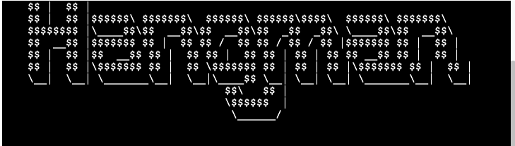

# Hangman

[Play Hangman Here](https://coates-hangman-5365a20f61de.herokuapp.com/)

## Description

This is a web application that allows you to play the classic game of Hangman. The game is terminal-based and has been written in Python. The objective of the game is to guess a word by suggesting letters within a certain number of tries.

To play the game, simply start the application and follow the prompts in the terminal. You can choose between different difficulty levels, which will determine the length and complexity of the word you have to guess.

Enjoy the game and good luck!

## User Stories

1. As a player, I want to be able to choose the difficulty level (easy/hard) before starting the game, so I can tailor the challenge to my skill level.

2. As a player, I want to receive visual feedback on the current state of the hangman after each incorrect guess, so I can keep track of my progress.

3. As a player, I want to see the word representation with underscores for unguessed letters, so I can see how many letters are in the word.

4. As a player, I want to be able to make guesses by entering a single letter or an entire word, so I have flexibility in how I approach the game.

5. As a player, I want to be notified if I've already guessed a letter, so I don't waste a guess on a letter I've already tried.

6. As a player, I want to see a list of my previous guesses, so I can keep track of which letters and words I've already attempted.

7. As a player, I want to be informed if I've won or lost the game, along with the correct word if I lose, so I know the outcome of the game.

8. As a player, I want the option to play the game again after a game is finished, so I can continue playing without having to restart the program.

## Features

- The game can be played in easy or hard mode, which determines the length of the word to be guessed. In the easy mode, the worxs are made up with no more than 4 letters, while in the hard mode, the words are made up with no more than 7 letters.

- After entering the difficulty level, the game displays the hangman in the terminal with a hangman ASCII art image.

- The game keeps track of the number of incorrect guesses and displays the hangman in the terminal.

- The game displays the word to be guessed with underscores for unguessed letters.

- The player can make guesses by entering a single letter or an entire word.

- The game notifies the player if they've already guessed a letter.

- The game displays a list of previous guesses.

- The game informs the player if they've won or lost the game, along with the correct word if they lose.

- The player can choose to play the game again after a game is finished.

## Error Handling

- The game displays an error message if the player does not type the difficulty level correctly. The difficulty level must be either 'easy' or 'hard' and written exactly as shown.

- In the main game area, the game displays an error message if the player does not type a single letter or an entire word. The player must type a single letter or an entire word and written exactly as shown.

-At the end of the game, the game displays an error message if the player does not type 'y' or 'n' to play again. The player must type 'y' or 'n' in either uppercase or lowercase.

## Wireframes

## Technologies Used

- Python - This project uses **Python** to write the game logic.
- Git - This project uses **Git** for version control.
- GitHub - This project uses **GitHub** to store and share all project code remotely.
- Heroku - This project uses **Heroku** to deploy the application.
- VS Code - This project uses **VS Code** as the IDE for writing the code.
- Google Chrome - This project uses **Google Chrome** as the browser for testing and viewing the application.

