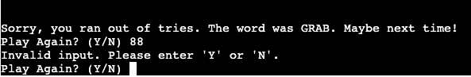

# Hangman

[Play Hangman Here](https://coates-hangman-5365a20f61de.herokuapp.com/)

## Description

This is a web application that allows you to play the classic game of Hangman. The game is terminal-based and has been written in Python. The objective of the game is to guess a word by suggesting letters within a certain number of tries.

To play the game, simply start the application and follow the prompts in the terminal. You can choose between different difficulty levels, which will determine the length and complexity of the word you have to guess.

Enjoy the game and good luck!

## User Stories

1. As a player, I want to be able to choose the difficulty level (easy/hard) before starting the game, so I can tailor the challenge to my skill level.

2. As a player, I want to receive visual feedback on the current state of the hangman after each incorrect guess, so I can keep track of my progress.

3. As a player, I want to see the word representation with underscores for unguessed letters, so I can see how many letters are in the word.

4. As a player, I want to be able to make guesses by entering a single letter or an entire word, so I have flexibility in how I approach the game.

5. As a player, I want to be notified if I've already guessed a letter, so I don't waste a guess on a letter I've already tried.

6. As a player, I want to see a list of my previous guesses, so I can keep track of which letters and words I've already attempted.

7. As a player, I want to be informed if I've won or lost the game, along with the correct word if I lose, so I know the outcome of the game.

8. As a player, I want the option to play the game again after a game is finished, so I can continue playing without having to restart the program.

## Features

- The game can be played in easy or hard mode, which determines the length of the word to be guessed. In the easy mode, the worxs are made up with no more than 4 letters, while in the hard mode, the words are made up with no more than 7 letters.

- After entering the difficulty level, the game displays the hangman in the terminal with a hangman ASCII art image.

- The game keeps track of the number of incorrect guesses and displays the hangman in the terminal.

- The game displays the word to be guessed with underscores for unguessed letters.

- The player can make guesses by entering a single letter or an entire word.

- The game notifies the player if they've already guessed a letter.

- The game displays a list of previous guesses.

- The game informs the player if they've won or lost the game, along with the correct word if they lose.

- The player can choose to play the game again after a game is finished.

## Error Handling

- The game displays an error message if the player does not type the difficulty level correctly. The difficulty level must be either 'easy' or 'hard' and written exactly as shown.

- In the main game area, the game displays an error message if the player does not type a single letter or an entire word. The player must type a single letter or an entire word and written exactly as shown.

-At the end of the game, the game displays an error message if the player does not type 'y' or 'n' to play again. The player must type 'y' or 'n' in either uppercase or lowercase.

## Wireframe

## Technologies Used

- Python - This project uses **Python** to write the game logic.
- Git - This project uses **Git** for version control.
- GitHub - This project uses **GitHub** to store and share all project code remotely.
- Heroku - This project uses **Heroku** to deploy the application.
- VS Code - This project uses **VS Code** as the IDE for writing the code.
- Google Chrome - This project uses **Google Chrome** as the browser for testing and viewing the application.
- GPT-3.5 - This project uses **GPT-3.5** to generate the word to be guessed.

## Testing

| Test Description | Expected Result | Actual Result | Pass/Fail |
| --- | --- | --- | --- |
| Test 1: To be able to select an easy or hard mode of the game with the letters 'e' or 'h' | The player can choose the difficulty level by entering 'easy' or 'hard' | 'easy' and 'hard' start the game. All other entries come up invalid | PASS |
| Test 2: To be able to enter a single letter which will either replace an asterix or appear in previous guesses if not in the word. | When a player makes a guess, that guess should be represented in the word or the list of previous guesses. | Works correctly | PASS |
| Test 3: To be able to guess an entire word| If the player guess a word, and it is correct, they win the game. If the word is wrong, it appears in the previously guessed list next to any letters guessed | Works as described | PASS |
| Test 4: Test the upper limit of guesses is 6.| After 6 guesses and not winning the game, the player should be told they have ran out of guesses | The game does not let the player have more then 6 guesses. When the player has run out of guesses, the game informs them so and tells them what the answer was. | PASS |
| Test 5: To be able to win the game by guessing all the letters or by guessing the entire word| The game is winnable | Game can be won both ways and displays a congratulations message. | PASS |
| Test 6: Play again. Whether the player wins or looses, they should be prompted to play again.| To be asked to play again and given the command for yes and no | Prompt to play again appears in both situations and only accepts the correct input of 'y' or 'n'. | PASS |

## Bugs

- I came across a bus when deploying the site to Heroku. I got an Error saying that the package install had failed due to an OSError. I was able to google the problem and found that the error was in the requirements.txt file. The six package had changed as shown in the image and had to be changed back to six==1.16.0

## Deployment

This project was deployed to Heroku using the following steps:

- On the mainpage of your Heroku account, click on the 'New' button and select 'Create new app'.
- Enter a name for your app and select the region closest to you.
- Click on the 'Create app' button.
- On the 'Deploy' tab, select 'GitHub' as the deployment method.
- Search for the repository you want to deploy from and click on the 'Connect' button.
- For this project, I used a Code Institute template in GitHub which had pre-installed packages necessary for deployment.
- On the 'Settings' tab, click on add buildpack and select Python.
- Click on add buildpack again and select node.js.
- Ensure that the Python buildpack is above the node.js buildpack.
- On the 'Deploy' tab, click on the 'Enable Automatic Deploys' button.
- Click on the 'Deploy Branch' button.
- Once the app has been deployed, click on the 'Open App' button to view the deployed site.

## How to clone a GitHub repository

- On GitHub, navigate to the main page of the repository.
- Above the list of files, click on the 'Code' button.
- To clone the repository using SSH, click on the 'SSH' button and copy the link.
- Open Git Bash.
- Change the current working directory to the location where you want the cloned directory to be made.
- Type 'git clone' and then paste the URL you copied earlier.
- Press 'Enter' to create your local clone.

## Credits

- The hangman ASCII art image was taken from [https://patorjk.com/software/taag/#p=testall&h=3&v=3&f=Graffiti&t=Hangman]
- I used a youtube tutorial to help me with the logic of the game. I also used this resource for the game stage images of the hangman. The link to the tutorial is [https://www.youtube.com/watch?v=m4nEnsavl6w&t=1s]
- I used a course called 100 days of python from Udemey and specifically the section on building a hangman game to help me with the game logic. The link to the course is [https://www.udemy.com/course/100-days-of-code/]
